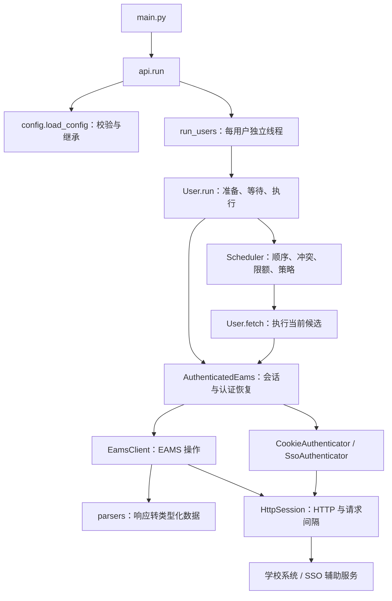

# TJU AutoCourse 架构说明

系统采用同步 `requests`：每个用户由独立工作线程执行，拥有自己的活动会话、请求计时器和选课进度，同一用户串行请求。调度模块决定“下一步选什么”，认证与请求模块负责“如何完成这次操作”。

## 从入口看一次运行

1. `load_config` 读取 YAML，校验字段并展开 `meta → 用户 → 目标组` 的策略继承。运行时拿到各自的配置对象，不通过全局配置传递状态。
2. `run_users` 为每个用户执行一个任务。普通运行调用 `User.run`；课程拉取调用 `User.prepare`。一个用户失败会记录错误，不会终止其他用户。
3. `User` 进入认证会话：登录或导入 Cookie，验证 EAMS 身份，激活配置的选课轮次。
4. 准备课程列表、已选课程，以及需要时的余量。必需数据获取失败就停止该用户。随后等待 `startTime`；无时区时间按本机时区解释。
5. `Scheduler` 按组、按候选顺序执行本地检查，通过 `User.fetch(course)` 尝试选课，再根据返回结果记账或决定下一步。
6. 离开上下文时关闭会话。Ctrl+C 设置各用户的取消事件，中断等待；在途请求返回或超时后退出。

## 各模块负责什么

| 模块 | 主要职责 | 不应放入的逻辑 |
| --- | --- | --- |
| `config.py` | Pydantic 校验、认证配置、策略继承 | HTTP 请求、运行进度 |
| `domain.py` | `Course`、`Meeting`、`Capacity`、`SelectionResult`、`Action`，以及冲突判断 | 登录、线程管理 |
| `scheduler.py` | 候选顺序、组限额、本地过滤、业务响应预算、运行报告 | URL、Cookie、SSO 流程 |
| `user.py` | 单用户准备、定时等待、取消与调度调用 | HTML 解析、登录协议 |
| `api.py` | `run` / `fetch_courses`、线程任务、用户失败隔离 | 每门课的重试决策 |
| `session.py` | `AuthenticatedEams` 拥有会话，首次登录、掉线恢复、恢复轮次与重放操作 | 课程优先级、组计数 |
| `auth.py` | Cookie 导入、CAS 表单与跳转、加密和 OCR 辅助流程 | 选课策略 |
| `eams.py` | 接口路径、请求参数、超时、认证失效检测，提供类型化课程操作 | 多用户调度、配置写回 |
| `parsers.py` | HTML 和嵌入数据解析、业务响应分类 | 网络和文件操作 |
| `transport.py` | Requests 会话、Cookie jar、HTTP 响应、时钟、0.55 秒间隔 | 课程成功计数 |
| `commands.py` | 初始化、快照检查、命令退出码 | 独立的认证实现 |
| `storage.py` | 配置原子写回、课程序号引号、JSON 快照读写 | 查询学校系统 |
| `logging.py` / `errors.py` | 日志初始化、可安全展示的异常类型 | 凭证或原始响应日志 |

项目规模较小，模块直接放在同一个包中；目录层级不承担额外的架构职责。`__init__.py` 导出主入口和常用配置类型，脚本只负责调用这些模块。

## 为什么会话、EAMS、HTTP 分开

以 `get_selected_courses(courses)` 为例：调用方只需要“获取已选课程”。`EamsClient` 知道该操作实际上需要先 GET 获取课表标识，再 POST 获取课表；`HttpSession` 会对这两次实际请求分别限速；`AuthenticatedEams` 则在认证失效时重登、恢复轮次并重新执行该操作。

因此，会话模块中的 `get_course_info` 等短方法虽然外观像转发，实际上统一附加了认证恢复行为。每个调用点都通过这些方法获得一致的掉线处理。

HTTP 与会话模块也承担不同的资源生命周期：重登会替换 `HttpSession`，但 `RequestLimiter` 仍由同一个 `AuthenticatedEams` 持有，避免新会话绕过请求间隔。

## 选课策略如何运行

假设第一组候选为 A、B，限额为 1，第二组候选为 C：

- 先检查 A 是否与已选课程冲突，以及是否通过余量预检查。
- A 返回 `not_open`，默认重试 A；期间不会去请求 B 或 C。
- A 返回 `full`，默认跳到 B；若为 `full` 配置了有限重试，则先消耗该响应自己的预算。
- B 明确成功，第一组计数变为 1，B 加入已选课程；随后进入第二组，并用更新后的已选课程检查 C 的冲突。
- 任意策略返回 `stop` 都结束该用户整轮运行。

`skipPre=true` 只绕过余量检查。冲突、顺序、限额、请求间隔仍然执行。`already_selected` 不增加本轮成功数。

超时、网关错误及无法识别的正文归为 `unknown`，默认继续下一个候选，不查询确认，也不增加成功计数。服务器可能已接受超时请求，因此实际选中数可能超过客户端计数。

## 两种重试、两类状态

| 状态 | 存放位置 | 何时更新或重置 |
| --- | --- | --- |
| 组成功数、当前组与候选位置 | `Scheduler.run` 的局部状态 | 组成功数在进入下一组时重置 |
| 已选课程 | `Scheduler.selected` | 从准备数据初始化，明确成功后追加 |
| 业务重试次数 | 当前候选的 `Counter` | 每种响应单独累计；下一候选重新计数 |
| SSO 恢复预算 | `AuthenticatedEams.execute` 的局部状态 | 每次业务操作单独分配；登录成功本身不补充预算 |
| 当前会话与 Cookie | `AuthenticatedEams` / `HttpSession` | 重登替换会话；服务器可更新 Cookie |
| 最近 EAMS 请求的发送时刻 | `RequestLimiter.last_start` | 每次实际 EAMS 请求前更新；重登不重置 |

业务重试处理“已满、未开放、过快”等有效业务结果，由 `Scheduler` 决定。认证重试处理掉线，由 `AuthenticatedEams` 完成。恢复认证期间还没有向调度模块返回新的业务结果，因此不会重置候选预算。

Cookie 明确失效就停止。SSO 首次最多登录 `1 + retries` 次；后续每次操作掉线最多重登 `retries` 次。新会话建立后还要验证身份、恢复轮次、重放原操作；如果原操作仍报认证失效，继续消耗本次预算，不能无限重登。

同一用户所有 EAMS 请求起点至少间隔 0.55 秒。CAS 和辅助服务不受该 EAMS 间隔约束，但都有超时；辅助服务使用独立会话。辅助服务所接收的数据见 README 中的认证说明。

## 三个辅助工具复用同一套模块

| 入口 | 调用路径 | 文件行为 |
| --- | --- | --- |
| `scripts/init.py` | `commands.initialize → AuthenticatedEams` | 仅补全成功获取的字段；`storage.write_config` 原子写回 YAML |
| `scripts/course_fetch.py` | `api.fetch_courses → run_users → User.prepare` | 导出完整课程与余量快照，不修改 `config.yaml` |
| `scripts/check_course.py` | `commands.check_courses → storage.load_snapshot` | 只读取配置和本地快照，不访问网络 |

快照名为 `course_info_<name>.json` 和 `course_statu_<name>.json`。课程号在 YAML 写回时强制带引号，以保留字符串类型和前导零。

## 修改与测试入口

- 修改响应识别：从 `parsers.parse_selection` 入手；修改动作或重试规则：看 `config.Rule` 与 `scheduler.decide`。
- 修改选课顺序、冲突或限额：看 `Scheduler` 与 `domain.Course`；修改开抢时间等待：看 `User.run`。
- 修改学校接口：看 `EamsClient` 和对应解析函数；修改 SSO 登录协议：看 `auth.py`；修改恢复预算：看 `session.py`。
- 修改请求间隔：看 `transport.REQUEST_INTERVAL`；修改 YAML 或快照格式：看 `storage.py`。

`tests/test_config.py`、`test_scheduler.py`、`test_parsers.py` 分别验证配置、调度与解析；`test_network.py` 用模拟 HTTP 验证登录链、Cookie、限速和恢复；`test_application.py` 验证用户生命周期、并发隔离及辅助工具读写。

调度模块接受选课回调，`User` 接受客户端和时钟，会话模块接受会话工厂。这些接口让测试能够模拟超时、掉线与时间推进，无需真实发起选课。离线测试不能替代真实学校服务的认证联调；真实认证联调已按用户要求跳过。
